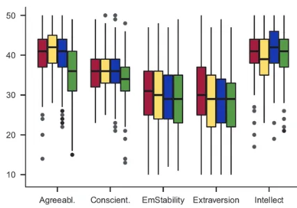

# Harry Potter Sorting Hat

Welcome to the **Harry Potter Sorting Hat** project! This machine learning-based web application classifies users into one of the four Hogwarts Houses based on their personality traits derived from the Big Five Personality Score.

---

## Table of Contents

- [Overview](#overview)
- [Features](#features)
- [Tech Stack](#tech-stack)
- [Installation](#installation)
- [Usage](#usage)
- [Dataset](#dataset)
- [Results](#results)
- [Model Details](#model-details)
- [Contributing](#contributing)
- [License](#license)

---

## Overview

This project uses a machine learning model to predict a user’s Hogwarts House: Gryffindor, Hufflepuff, Ravenclaw, or Slytherin. The classification is based on the Big Five Personality Score, which measures personality traits such as openness, conscientiousness, extraversion, agreeableness, and neuroticism.

---

## Features

- Interactive web application to predict Hogwarts House
- Dynamic UI for personality trait input
- Integration of a trained ML model with Flask backend
- Accurate predictions with 81.34% accuracy on test data

---

## Tech Stack

### Frontend
- **HTML**
- **CSS**
- **JavaScript**
- **Bootstrap**

### Backend
- **Python**
- **Flask**

### Machine Learning
- **scikit-learn**
- **pandas**
- **numpy**

---

## Installation

Follow these steps to set up the project locally:

1. Clone the repository:
    ```bash
    git clone https://github.com/Angad-2002/Harry-Potter-Sorting-Hat.git
    cd Harry-Potter-Sorting-Hat
    ```

2. Create a virtual environment and activate it:
    ```bash
    python -m venv venv
    # For Windows:
    venv\Scripts\activate
    # For macOS/Linux:
    source venv/bin/activate
    ```

3. Install the required dependencies:
    ```bash
    pip install -r requirements.txt
    ```

4. Run the Flask application:
    ```bash
    python app.py
    ```

5. Open your browser and go to:
    ```
    http://127.0.0.1:5000/
    ```

---

## Usage

1. Input your Big Five Personality traits into the form on the web application.
2. Submit the form to get your Hogwarts House prediction.
3. View your house along with a brief description of its qualities.

---

## Dataset

The project uses a preprocessed dataset containing individuals’ Big Five Personality Scores and their associated Hogwarts Houses. The dataset was cleaned and split into training and testing sets for model evaluation.

### Box Chart Representation

The dataset was created based on the personality traits visualized in the following box chart:



The chart represents the distribution of traits such as Agreeableness, Conscientiousness, Emotional Stability, Extraversion, and Intellect for individuals grouped by their Hogwarts Houses.

---

## Results

- **Model Accuracy**: 81.34% on the test dataset.
- **Classifier**: Trained using scikit-learn's machine learning algorithms.

---

## Model Details

The project employs the **Gaussian Naive Bayes Classifier** to classify individuals into Hogwarts Houses. Key highlights of the model:

- **Algorithm**: Gaussian Naive Bayes
  - Assumes that features follow a Gaussian (Normal) distribution.
  - Suitable for continuous input features like personality trait scores.
  - Simple and computationally efficient.

- **Why Gaussian Naive Bayes?**
  - Works well with smaller datasets.
  - Handles continuous data effectively by modeling feature likelihoods with Gaussian distribution.
  - Provides fast predictions, ideal for a real-time application like this.

---

## Contributing

Contributions are welcome! If you have suggestions or improvements, feel free to:

1. Fork the repository.
2. Create a new branch:
    ```bash
    git checkout -b feature-name
    ```
3. Commit your changes:
    ```bash
    git commit -m 'Add some feature'
    ```
4. Push to the branch:
    ```bash
    git push origin feature-name
    ```
5. Open a Pull Request.

---

## License

This project is licensed under the [MIT License](LICENSE).

---

## Contact

For any inquiries, feel free to reach out:

- **Author**: Angad Singh  
- **Email**: angadsingh.11.09.2002@gmail.com  
- **GitHub**: [Angad-2002](https://github.com/Angad-2002)
